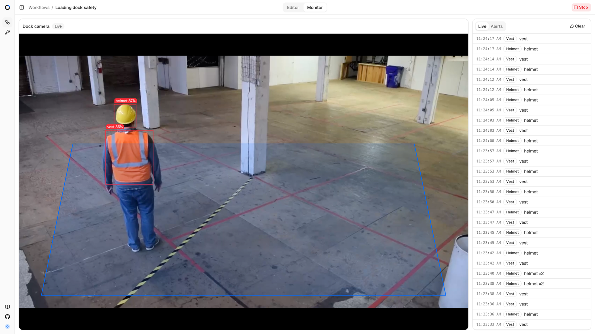
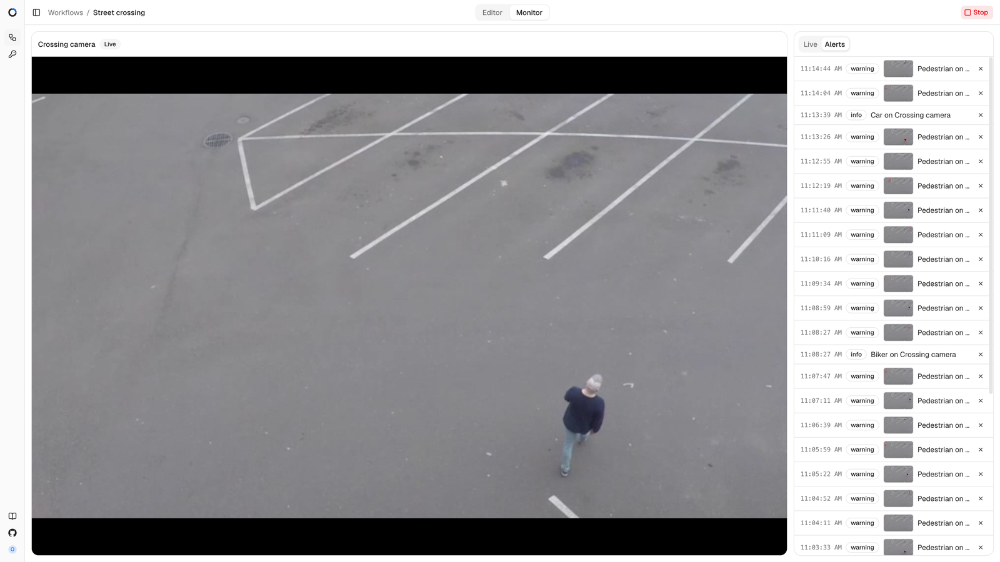

[Documentation](index.md) / Monitoring and alerts

# Monitoring and alerts

Every workflow has a monitor page that shows the camera live with detection
overlays, a feed of the events the graph produces, and the alert history.
The header switches between **Editor** and **Monitor** and holds the **Run**
and **Stop** button.

## Live view

The video is the camera's stream played over WebRTC from MediaMTX. Above it
sits the camera name and a status badge: **Starting** while the worker
connects, **Live** when frames flow, **Error** with the reason when the
stream failed, **Off** when the workflow is stopped. A workflow with several
cameras gets a camera picker.

Overlays are drawn on top of the video:

- **Bounding boxes** for the current detections, labelled with the class.
  They disappear three seconds after the last detection message.
- **Zones and lines** from the Zone, Count, Dwell, and Line crossing filters
  in the graph, so you can see what the filters test against.

Cameras of type **Browser webcam** show a **Publish** button that starts
sending the browser's camera; **Stop publish** ends it. Opening the editor or
monitor of a running workflow starts publishing automatically.

## Event feed

The **Live** tab lists the events that passed the event cooldown, newest
first, with the time, the event kind, and the labels behind it. It keeps the
last thirty entries; **Clear** empties it. The feed reflects what enters the
graph, before filters, so it is the place to check whether a model produces
the events you expect.

## Alerts

The **Alerts** tab lists alerts recorded by the Alert action for this
workflow, with the time, the severity, a snapshot thumbnail when a Snapshot
ran before the Alert, and the message. The message is the humanized event
kind and the camera name, for example *Pedestrian on Crossing camera*. Each
row has a delete button; the API can also clear the history per camera or
workflow.

Severity is set on the Alert node: **info**, **warning**, or **critical**.
The alert's **cooldown** suppresses repeats per camera within the window;
`0` records every event. Alerts stay until deleted, so long-running
instances should clear them from time to time through `DELETE /alerts`.

New alerts and camera errors also surface as notifications in the corner of
Studio while the workflow's pages are open.

## Snapshots

The Snapshot action saves the camera's latest frame as a JPEG. With
**Annotate** on, detections are drawn onto the image. Files are stored in
the `api_snapshots` volume and served at `/snapshots/<file>` to signed-in
users; alerts, webhooks, Telegram, Discord, Slack, and email messages
downstream of the Snapshot node receive the URL, and the messaging actions
attach the image itself.

A snapshot reflects the most recent frame the inference service stored,
which is at most `LAST_FRAME_TTL_SECONDS` old; if a camera stopped
producing frames, the action logs a warning and skips.

## Realtime access

Everything the monitor shows comes from one WebSocket per camera,
`/ws/cameras/{camera_id}`. Scripts can subscribe to the same stream; the
messages are documented in [API](api.md#websocket).
