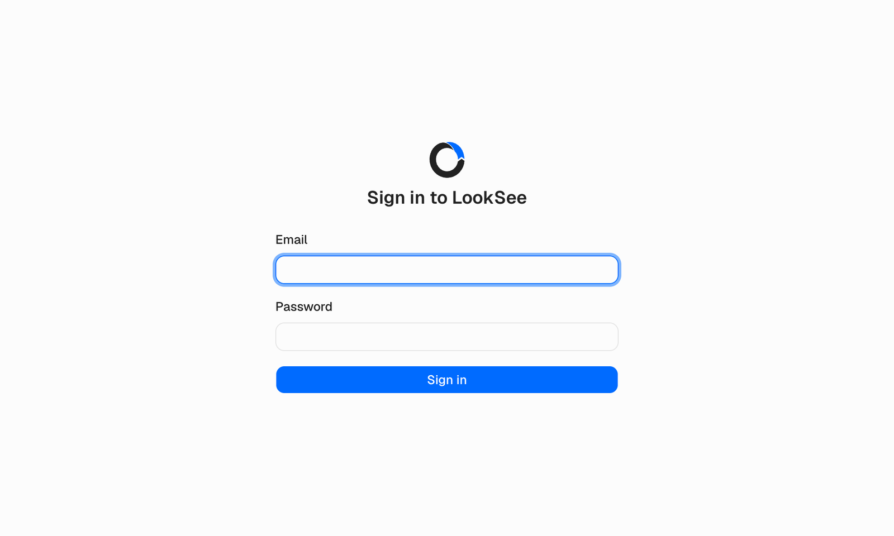

[תיעוד](index.md) / תחילת העבודה

# תחילת העבודה

עמוד זה מוביל את LookSee ממכונה נקייה ועד Studio מחובר עם מודל זיהוי מוכן לשימוש. הוא משתמש ב-Docker Compose, שהיא הדרך הנתמכת להרצת LookSee.

## דרישות

- Docker Engine עם Docker Compose 2.24 ואילך. Docker Desktop עובד ב-macOS וב-Windows; שרתי Linux הם יעד הייצור המקובל.
- מעבד x86 או ARM של 64 סיביות. הזיהוי רץ על המעבד (CPU) כברירת מחדל; GPU עם CUDA הוא אופציונלי ומתואר ב[פריסה](deployment.md#הסקה-על-gpu).
- פורטים פנויים: `3000` (Studio), `8000` (API), `8554` (RTSP), `8889` (WebRTC) ו-`8189/udp` (WebRTC ICE). PostgreSQL, Valkey, אחסון הווידאו ו-API הבקרה של MediaMTX מאוגדים לממשק ה-loopback בלבד.

קובץ ה-compose מגביל כל שירות. שירות ההסקה (inference) מקבל 4 מעבדים ו-4 GB זיכרון כברירת מחדל; העלו את `INFERENCE_CPUS` ואת `INFERENCE_MEMORY` ב-`.env` עבור יותר מצלמות או מודלים גדולים יותר.

## התקנה

```bash
git clone https://github.com/okoflow/looksee.git
cd looksee
cp .env.example .env
```

פתחו את `.env` והגדירו את הערכים הבאים לפני ההפעלה הראשונה:

| משתנה | ערך |
| --- | --- |
| `WEBRTC_HOST_IP` | `127.0.0.1` כאשר הדפדפן רץ על אותה מכונה. כתובת המכונה ברשת שלכם, למשל `192.168.1.20`, כאשר פותחים את Studio ממכשיר אחר. דפדפנים מתחברים לכתובת זו לצפייה בווידאו חי. |
| `POSTGRES_PASSWORD`, `MTX_MEDIA_PASSWORD`, `STORAGE_PASSWORD` | ערכים פרטיים משלכם. הם ריקים ב-`.env.example`, והסטאק מסרב לעלות עד שהם מוגדרים. |

לאחר מכן בנו והפעילו את הסטאק:

```bash
docker compose up -d --build
docker compose ps
```

הבנייה הראשונה מורידה אימג'ים בסיסיים וחבילות Python ו-Node ונמשכת כמה דקות. `docker compose ps` מציג כל שירות במצב `healthy` כשהסטאק מוכן: `storage`, `postgres`, `redis`, `mediamtx`, `api`, `inference` ו-`studio`. השירותים החד-פעמיים `storage-init`, `api-migrate` ו-`media-cache-init` מסתיימים אחרי שהם משלימים את עבודתם.

## יצירת חשבון הבעלים

פתחו את `http://<WEBRTC_HOST_IP>:3000`. Studio מפנה לעמוד ההגדרה הראשונית כל עוד לא קיים חשבון. הזינו כתובת דוא"ל, שם תצוגה וסיסמה של שמונה תווים לפחות עם ספרה אחת ואות רישית אחת. החשבון הופך לבעלים של המופע (instance) ואתם מחוברים.

> [!WARNING]
> עד שהבעלים קיים, כל מי שיכול להגיע לפורט `3000` יכול לתבוע את המופע לעצמו. צרו את החשבון מיד אחרי ההפעלה הראשונה, והשאירו את הסטאק ברשת מהימנה. [אבטחה](security.md) מכסה את השאר.



## הוספת מודל זיהוי

LookSee מסופקת בלי מודלים. מודל הוא ספרייה תחת `models/` בעותק המאגר עם שני קבצים:

```text
models/
└── ppe-helmets/
    ├── manifest.json
    └── model.onnx
```

`model.onnx` הוא מודל D-FINE שיוצא ל-ONNX. `manifest.json` נותן למודל שם ומפרט את המחלקות שלו:

```json
{
  "name": "Safety gear (PPE)",
  "labels": ["head", "helmet", "vest"],
  "recommended_confidence_threshold": 0.4
}
```

הספרייה `models/` מחוברת (mount) לקריאה בלבד לקונטיינרים של ה-API ושל ההסקה, וה-API מגלה חבילה חדשה בבקשה הבאה, כך שאין צורך באתחול מחדש. כל תווית הופכת לסוג אירוע כמו `HELMET_DETECTED`. [מודלים](models.md) מתאר את המניפסט במלואו ואת דרך ייצוא המודל.

## בדיקת הסטאק

```bash
curl http://127.0.0.1:8000/health
docker compose logs -f api inference
```

ה-API מחזיר `{"status":"ok"}`. תיעוד API אינטראקטיבי מוגש בכתובת `http://127.0.0.1:8000/docs`.

## פקודות יומיומיות

```bash
docker compose logs -f studio api inference mediamtx   # follow logs
docker compose stop                                    # stop, keep data
docker compose up -d                                   # start again
git pull && docker compose up -d --build               # upgrade
docker compose down -v                                 # remove everything, including data
```

תהליכי עבודה, מצלמות, אישורי גישה, התראות, תמונות מצב, סרטונים שהועלו וסוד החתימה נשמרים ב-volumes בעלי שם. `down -v` מוחק אותם; [פריסה](deployment.md) מסביר כיצד לגבות אותם.

## בשלב הבא

[תהליך העבודה הראשון שלכם](first-workflow.md) בונה תהליך עבודה לבקרת חבישת קסדות מהקנבס ומעלה ומציג אותו רץ במוניטור.
