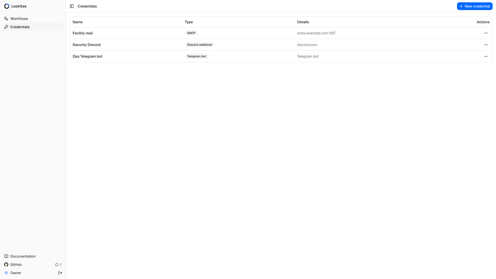

[Документация](index.md) / Действия и интеграции

# Действия и интеграции

Действия — это узлы в конце рабочего процесса: они превращают событие в
оповещение, снимок или сообщение внешней системе. Действия, которые
обращаются к сервису, аутентифицируются учётными данными, сохранёнными в
LookSee.

## Учётные данные

Страница **Credentials** (учётные данные) перечисляет сохранённые учётные
данные с именем, типом и несекретной сводкой, такой как хост SMTP или домен
вебхука. **New credential** (новые учётные данные) запрашивает **Name**,
**Type** и поля этого типа. Сам секрет шифруется ключом, производным от
секрета экземпляра, и больше никогда не показывается; редактирование учётных
данных без ввода нового секрета сохраняет прежний.

| Тип | Используется | Поля `payload` |
| --- | --- | --- |
| `telegram_bot` | Telegram | `bot_token` |
| `discord_webhook` | Discord | `webhook_url` |
| `slack_webhook` | Slack (Enterprise) | `webhook_url` |
| `smtp` | Email | `host`, `port` (по умолчанию 587), `username`, `password`, `from_address`, `starttls` (по умолчанию включено) |
| `mqtt` | MQTT | `host`, `port` (по умолчанию 1883), `username`, `password` |

Действия ссылаются на учётные данные по идентификатору и проверяют их тип при
запуске рабочего процесса: действие Telegram с учётными данными SMTP
проваливает **Run** с ошибкой `credential_type_mismatch`. Учётные данные
разрешаются в момент доставки сообщения, поэтому замена токена сразу
применяется к запущенным рабочим процессам.

## Шаблоны сообщений

Действия Telegram, Discord, Slack, Email и MQTT формируют текст из шаблона с
такими подстановками:

| Подстановка | Значение |
| --- | --- |
| `{kind}` | Тип события, например `HELMET_DETECTED` |
| `{camera_id}` | Идентификатор камеры |
| `{ts}` | Время события в формате ISO 8601 |
| `{count}` | Сколько детекций породили событие |
| `{snapshot_url}` | Путь к снимку, если ранее сработал Snapshot; иначе пусто |

Шаблон сообщения по умолчанию — `[{kind}] camera={camera_id} at {ts}`.
Шаблон с неизвестной подстановкой отправляется как есть, а в журнал пишется
предупреждение.

## Alert

Записывает событие в историю оповещений и показывает его в мониторе. Поля:
`severity` (`info`, `warning`, `critical`) и `cooldown_seconds` в секундах (от 0
до 3600, по умолчанию 30). В течение паузы повторы на той же камере
отбрасываются; `0` записывает каждое событие. Alert — единственное действие с
историей внутри LookSee; её описывает раздел
[Мониторинг и оповещения](monitoring-and-alerts.md).

## Snapshot

Сохраняет последний кадр камеры как JPEG с нарисованными детекциями, когда
включено `annotate` (по умолчанию). Snapshot — единственное действие с
выходом: подключайте после него действия, которые должны нести изображение.
Они получают `snapshot_url` для шаблонов и тел запросов, а Telegram, Discord,
Slack и Email прикладывают само изображение.

## Webhook

Отправляет событие как JSON на URL выбранным методом (`POST` по умолчанию,
`GET` или `PUT`). Учётные данные не нужны; если получатель требует токен,
поместите его в URL. Запрос прерывается через пять секунд; ответы `5xx`,
`408` и `429` повторяются, остальные ошибки — нет. Каждый запрос несёт
идентификатор доставки в заголовке `Idempotency-Key`. Тело запроса описано
в разделе [API](api.md#тело-запроса-webhook).

## Telegram

Отправляет в чат сообщение или, когда доступен снимок, фотографию с подписью.
Создайте бота через [@BotFather](https://t.me/botfather) в Telegram,
сохраните его токен как учётные данные `telegram_bot`, добавьте бота в нужный
чат и укажите идентификатор чата в действии. Для личного чата сначала
напишите боту, а затем прочитайте идентификатор чата из
`https://api.telegram.org/bot<token>/getUpdates`.

## Discord

Публикует в канал через входящий вебхук. Создайте вебхук в настройках
интеграций канала, сохраните его URL как учётные данные `discord_webhook` и
задайте шаблон сообщения. Discord ограничивает сообщения 2000 символами;
более длинные тексты обрезаются.

## Slack

Редакция Enterprise. Публикует в канал через входящий вебхук Slack,
сохранённый как учётные данные `slack_webhook`, с теми же подстановками в
шаблоне.

## Email

Отправляет сообщение по SMTP с шаблонами темы и тела и прикладывает снимок,
когда он доступен. Сохраните сервер как учётные данные `smtp`. `starttls`
переводит соединение на TLS после подключения — именно этого ожидает порт
587; отправитель — `from_address` или `username`, когда первое пусто. Поле:
`to` — один адрес или список через запятую, который принимает ваш сервер.

## MQTT

Публикует в топик брокера, сохранённого как учётные данные `mqtt`. Поля:
`topic` (по умолчанию `looksee/events`) и `payload_template`. Пустой
шаблон публикует тот же JSON, что и вебхук; заполненный — свой
отрисованный текст. Соединения прерываются через пять секунд.

## Поведение доставки

- Alert и Snapshot выполняются сразу, в порядке графа, для каждого события,
  которое до них доходит. Webhook, Telegram, Discord, Slack, Email и MQTT
  ставятся в очередь доставок в PostgreSQL и отправляются рабочим процессом
  внутри API, поэтому медленный получатель не задерживает детекцию.
- Доставка, упавшая по временной причине (тайм-аут, HTTP `408`, `429` или
  `5xx`), повторяется с задержкой, удваивающейся после каждой попытки, до
  пяти минут и не более восьми попыток. Остальные сбои окончательны.
  Сообщение доставляется как минимум один раз; `GET /deliveries`
  показывает очередь.
- Действие, завершившееся ошибкой, не останавливает остальные действия
  события, и каждое действие выполняется не более одного раза на событие,
  даже когда к нему ведут две ветки.
- Секреты никогда не попадают в журналы; сбои доставки записываются только с
  указанием действия и статуса.
- Исходящие запросы используют один общий пул соединений и идут напрямую из
  контейнера API; настройте прокси или брандмауэр соответственно.
