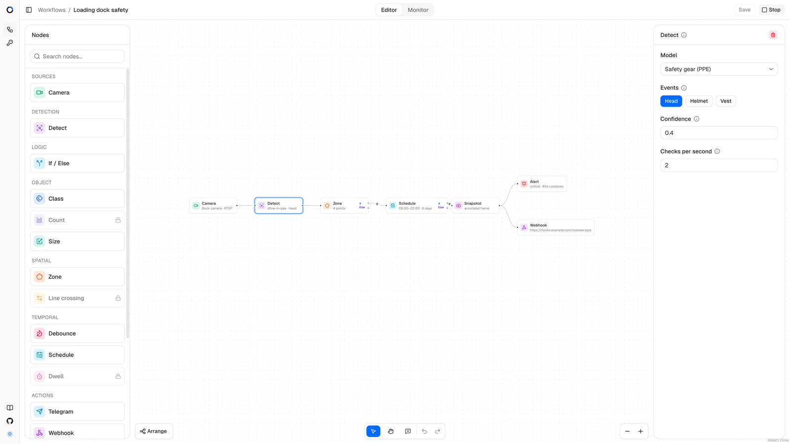

# Документация LookSee

[English](../en/index.md) · **Русский** · [עברית](../he/index.md) · [한국어](../ko/index.md)

LookSee — система видеоаналитики, которую вы размещаете у себя. Она
наблюдает за прямыми трансляциями, веб-камерами браузера и видеофайлами,
выполняет на них детекцию объектов ONNX и превращает детекции в события. Что
происходит дальше, решает граф рабочего процесса: фильтры отбирают только
значимые события, а действия доставляют оповещения, снимки и сообщения людям
и системам, которым они нужны.

Всё работает на вашем оборудовании из одного файла Docker Compose. Исходный
код находится в репозитории [okoflow/looksee](https://github.com/okoflow/looksee)
под лицензией Apache-2.0; редакция Enterprise добавляет пересечение линии,
время пребывания, подсчёт и Slack.

## С чего начать

- [Начало работы](getting-started.md) — установка через Docker Compose,
  создание учётной записи владельца, добавление модели детекции.
- [Ваш первый рабочий процесс](first-workflow.md) — от пустого холста до
  работающего оповещения.

## Руководство

- [Основные понятия](concepts.md) — рабочие процессы, узлы, события, камеры
  и запуски.
- [Камеры](cameras.md) — RTSP, RTMP, SRT, веб-камеры браузера, WHEP и
  видеофайлы.
- [Модели](models.md) — формат пакета модели, как метки становятся
  событиями и как экспортировать модель D-FINE в ONNX.
- [Узлы](nodes.md) — каждый узел с его полями, ограничениями и правилами
  проверки.
- [Действия и интеграции](actions-and-integrations.md) — учётные данные,
  шаблоны сообщений, Telegram, Discord, электронная почта, MQTT, вебхуки и
  Slack.
- [Мониторинг и оповещения](monitoring-and-alerts.md) — живой просмотр,
  лента событий, история оповещений и снимки.

## Эксплуатация

- [Конфигурация](configuration.md) — каждая переменная окружения, порт и
  том.
- [Развёртывание](deployment.md) — сервер в вашей сети, TLS, GPU, резервные
  копии и обновления.
- [Безопасность](security.md) — учётные записи, сессии, секреты и доступ к
  медиа.
- [Устранение неполадок](troubleshooting.md) — камеры, застрявшие в
  ожидании, отсутствие видео, пропавшие модели, недоставленные оповещения.

## Справочник

- [API](api.md) — конечные точки HTTP, сообщения WebSocket и формат ошибок.
- [Редакция Enterprise](enterprise.md) — редакции, возможности и
  лицензионный ключ.
- [История изменений](changelog.md) — история выпусков.

## Участие в разработке

Документация — это Markdown в репозитории
[looksee-docs](https://github.com/okoflow/looksee-docs); его README
перечисляет правила написания. Вклад в код следует
[CONTRIBUTING.md](https://github.com/okoflow/looksee/blob/main/CONTRIBUTING.md)
в основном репозитории, а сообщения об уязвимостях идут через
[приватную форму](https://github.com/okoflow/looksee/security/advisories/new).
